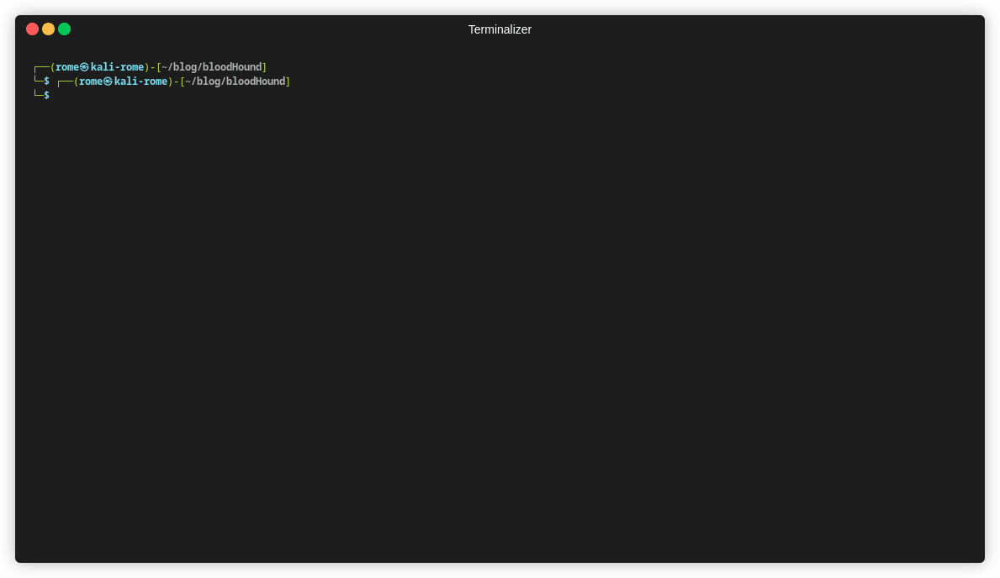

# BloodHound CE and automating parts of AD pentests

Blog Post: [BloodHound CE and automating parts of AD pentests](https://www.8com.de/cyber-security-blog/bloodhound-ce-and-automating-parts-of-ad-pentests)



## Usage

1. setup BloodHound CE using the provided [docker-compose files](https://github.com/SpecterOps/BloodHound/tree/main/examples/docker-compose) and enable the neo4j port
2. generate the API token and download the current version of SharpHound from the GUI
3. enter your API token (and the changed neo4j password, if applicable) into the script
4. run SharpHound from a domain joined host
5. extract the .zip archive 
6. run the following commands

```
python -m venv adAnalysis
source adAnalysis/bin/activate
python -m pip install neo4j requests
python adAnalysis.py -d <pathToJsonDir>
```

The script will print out all the findings and write the files in the current directory. The following data will be written to the csv-files:

- laps.csv: computer name, computer objectid
- unsupportedOs.csv: computer name, computer objectid
- inactiveUsers.csv: username, user objectid, is user enabled (true or false), is user admin (true or false)
- inactiveComputers.csv: computer name, computer objectid, is computer enabled (true or false)
- domainAdmins.csv: username, user objectid
- tierZeroUsers.csv: username, user objectid
- kerberoastableUsers.csv: username, user objectid, user service principal names, user system tags (Tier Zero os NULL)
- asrepRoastableUsers.csv: username, user objectid, user system tags (Tier Zero os NULL)
- tierZeroSessions.csv: username, user objectid, computer name, computer objectid
- dcsync.csv: username, user objectid
- constrainedDelegation.csv: username, user objectid, computer name, computer objectid
- unconstrainedDelegation.csv: object name, object objectid
- resourcebasedConstrainedDelegation.csv: object name(allowed to act), object objectid(allowed to act), object name(target object), object objectid(target object)
